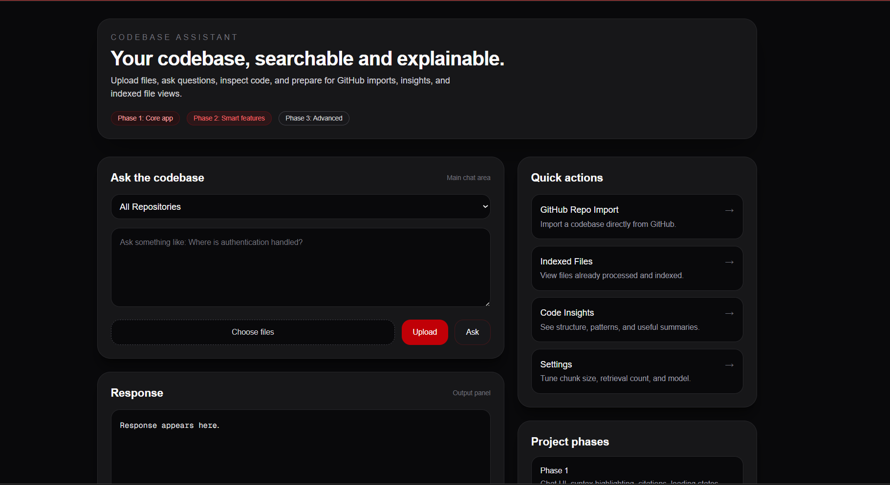
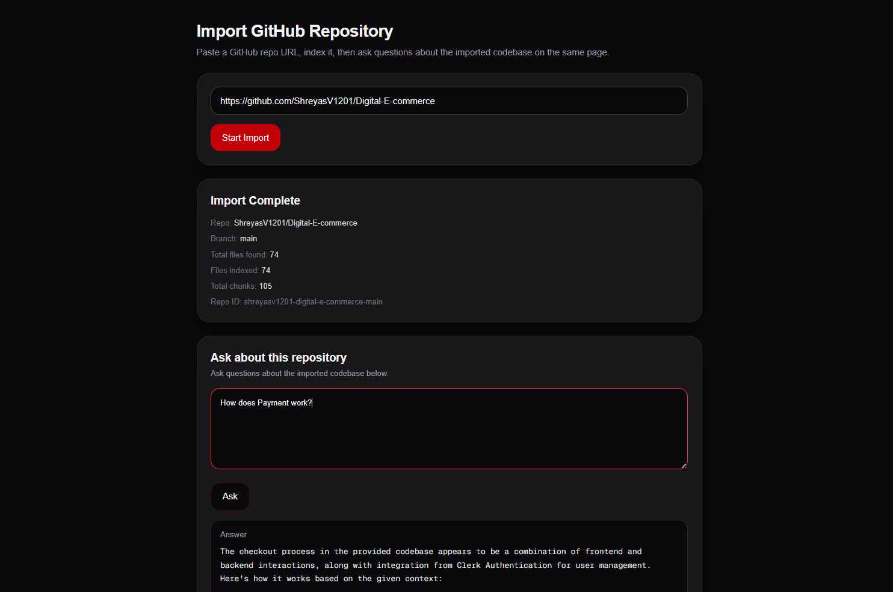
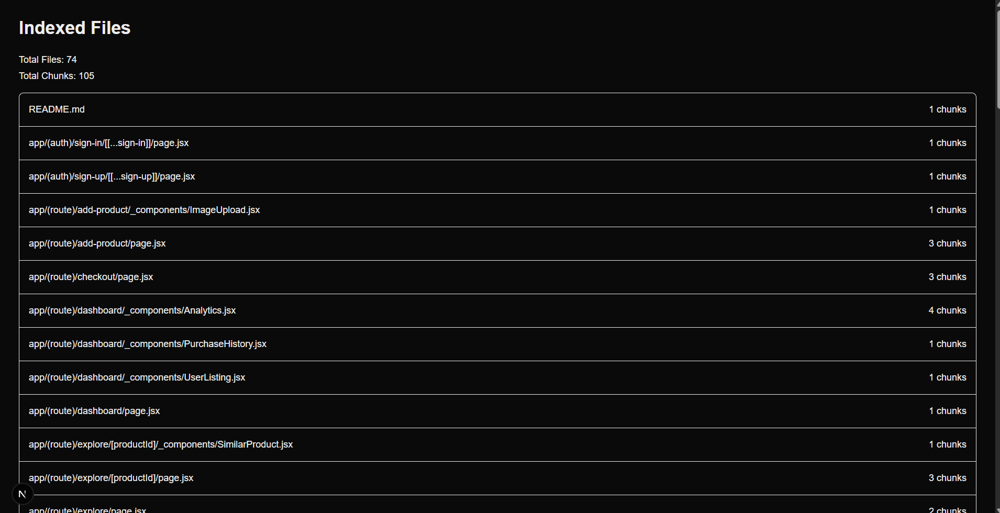
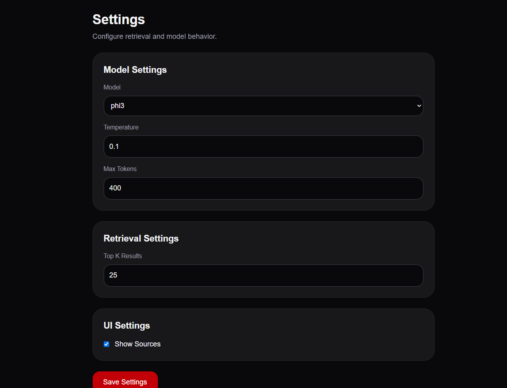

# 🚀 RAG Codebase Assistant

An AI-powered Codebase Assistant that allows developers to import GitHub repositories, index source code into a vector database, and ask natural language questions about an entire codebase.

Built with **Next.js**, **ChromaDB**, **Ollama**, and **Local Embeddings**.

---

## 📸 Screenshots

### Home Page




### GitHub Repository Import




### Indexed Files




### Settings Page




---

## ✨ Features

### 🔍 AI-Powered Code Search

Ask questions such as:

* How does authentication work?
* Which database is used?
* What are the main API routes?
* Explain the project architecture.
* Where is user management implemented?

The assistant retrieves relevant code chunks and generates answers using a local LLM.

---

### 📦 GitHub Repository Import

Import public GitHub repositories directly.

The system:

1. Crawls repository files
2. Filters supported source files
3. Chunks code intelligently
4. Generates embeddings
5. Stores vectors in ChromaDB

---

### 📄 Document Upload Support

Upload local files and index them into the vector database.

Supported formats:

* TXT
* PDF
* DOCX

---

### 🧠 Retrieval-Augmented Generation (RAG)

The assistant uses:

* Local embeddings
* Semantic search
* Vector similarity retrieval
* Context-aware answer generation

to answer questions grounded in the indexed codebase.

---

### 📚 Multi-Repository Support

Query:

* A specific repository
* Multiple repositories
* Entire indexed collection

through repository filtering.

---

### ⚙️ Configurable Settings

Customize:

* LLM Model
* Temperature
* Maximum Tokens
* Top-K Retrieval Results
* Source Visibility

without changing code.

---

### 📊 Codebase Insights

Generate quick insights about indexed repositories:

* File distribution
* Repository metadata
* Indexed content overview
* Repository statistics

---

### 📁 Indexed File Explorer

Browse all indexed files currently stored in the vector database.

Useful for:

* Verification
* Debugging
* Retrieval inspection

---

## 🏗️ Architecture

```text
GitHub Repo / Uploaded Files
            │
            ▼
      Text Extraction
            │
            ▼
       Chunking Layer
            │
            ▼
      Xenova Embeddings
            │
            ▼
         ChromaDB
            │
            ▼
     Similarity Search
            │
            ▼
       Retrieved Context
            │
            ▼
      Ollama (Phi-3)
            │
            ▼
        Final Answer
```

---

## 🛠️ Tech Stack

### Frontend

* Next.js 16
* React 19
* TypeScript
* Tailwind CSS

### Backend

* Next.js Route Handlers
* Node.js

### AI / RAG

* Ollama
* Phi-3
* Xenova Transformers
* ChromaDB
* LangChain Text Splitters

### File Processing

* pdf-parse
* Mammoth

---

## 📂 Project Structure

```text
app/
├── api/
│   ├── ask/
│   ├── github/
│   ├── upload/
│   ├── repos/
│   ├── insights/
│   └── indexed-files/
│
├── import/
├── indexed-files/
├── insights/
├── settings/
│
└── lib/
    ├── chunkText.ts
    ├── embeddings.ts
    ├── github.ts
    ├── githubImport.ts
    ├── indexedFiles.ts
    ├── insights.ts
    ├── llm.ts
    ├── rag.ts
    ├── settings.ts
    └── vectorStore.ts
```

---

## ⚡ Installation

### Clone Repository

```bash
git clone https://github.com/ShreyasV1201/RAG-Codebase-assistant.git
cd RAG-Codebase-assistant
```

### Install Dependencies

```bash
npm install
```

### Start ChromaDB

```bash
docker run -p 8000:8000 chromadb/chroma
```

### Start Ollama

```bash
ollama serve
```

Pull Phi-3:

```bash
ollama pull phi3
```

### Run Application

```bash
npm run dev
```

---

## 🔮 Planned Improvements

### Phase 3

* Streaming Responses
* AST-Based Chunking
* Conversation Memory
* Better Repository Summaries
* Improved Retrieval Ranking

### Future Ideas

* Hybrid Search
* Repository Comparison
* Agentic Repository Navigation
* Diagram Generation
* Code Flow Visualization
* Cloud Deployment Support

---

## 👨‍💻 Author

**Shreyas V**

Computer Science & Engineering (Cybersecurity)

Built as a personal project to explore:

* Retrieval-Augmented Generation (RAG)
* Vector Databases
* Local LLMs
* Code Understanding Systems
* AI Developer Tools
